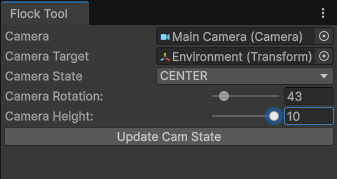

# BoidSanctuary
Personal implementation of Craig Reynolds' ["Boids"](https://cs.stanford.edu/people/eroberts/courses/soco/projects/2008-09/modeling-natural-systems/boids.html) in the Unity Game Engine.

## Flock Tool

- *Camera*: Reference to the camera component that is being moved by the tool
- *Camera Target*: The transform component that is being targeted by the camera moves
- *Camera State*: Enum of the different ways the camera can present itself
    - Top, North, East, South, West: all fixed camera positions
    - Center: adjustable with the *Camera Rotation* and *Camera Height* variable sliders
- *Update Cam State*: button that triggers the reload of the camera state setting its position and rotation
- *Animate Camera*: button for beginning an animation that is currently hard coded to 5 seconds around the environment
- *Stop Coroutine*: button for stopping the EditorCoroutine that is controlling the camera animation

## Current State
Main Components: `BoidScript`, `FlockScript`, `FibScript`

The `FlockScript` is responsible for managing the overall simulation. It starts by gathering or creating the "Flock" (a collection of `Boid` prefabs/objects). The simulation is then performed per every `FixedUpdate` which is set to 0.0166 (roughly a 60 frame per second rate). The simulation adheres to steering behaviors, the various checks that are required for the Boid Algorithm: Separation, Alignment, Cohesion. On top of these steering behaviors the 

https://github.com/user-attachments/assets/fbb3f1f2-d485-43c6-8d3d-484ceca65899

## Next Steps (Updated 7/30/2025)
1. General code cleanup, there are a few portions of commented out code either from testing or a better solution was found and I failed to delete the old one. I also noticed when updating this ReadMe that a few functions that appeared to have no references to them, these are likely going to be handled under a "Boid refactor".
2. Boid refactor, the `BoidScript` was initially written to include the steering behaviors internally. This was a failure to understand that the steering behaviors only work by iterating over all of the boids and thusly made more sense to relegate that functionality to a over arching manager class which ended up being the `FlockScript`.
3. (Nice to do) Spatial optimization, utilizing something like an oct-tree would likely allow me to scale up the number of boids that I am able to display on the screen at once.
4. Improved `Flock Tool`, the editor window `Flock Tool` was initially created to assist with showing off the functionality of the project as well as demonstrate a basic example of **Dev Tooling** in Unity. Expanding further on this I would like to see more features added to this tool and possible additional tools created if necessary. One upgrade to the `Flock Tool` might be to allow for tracking of an individual boid to give the camera a perspective, similar to a Third Person camera view in a video game. Basic testing with setting the camera as a child of the `Main Camera` yielded promising results.
